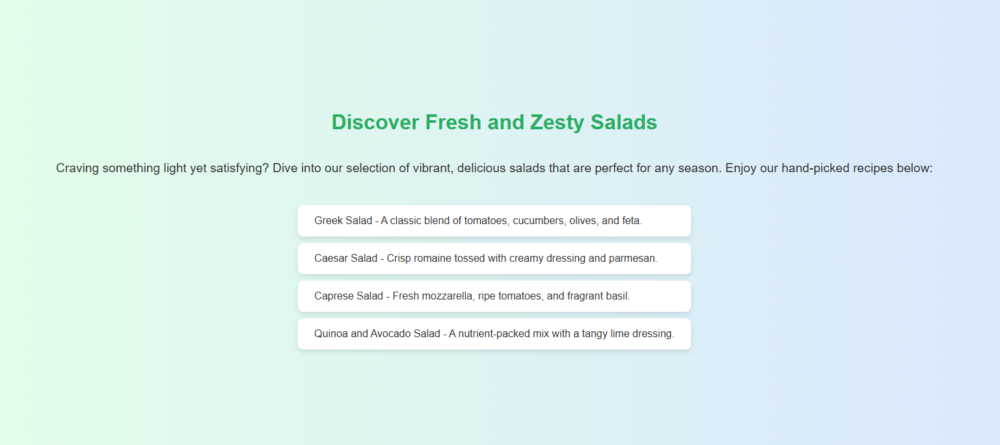
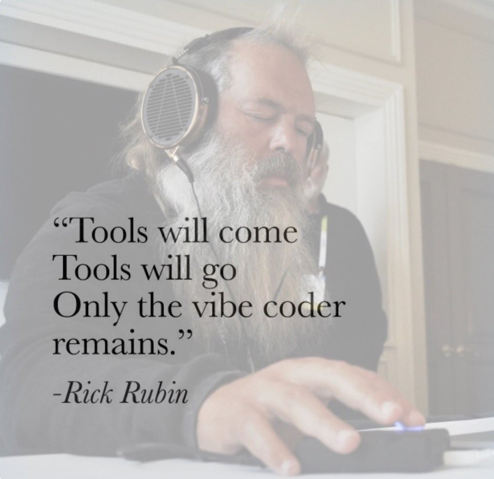

# vibe-http



A tiny HTTP server that passes the HTTP request to OpenAI's ChatGPT API and returns the response.

Consequentially, each website visitor will get a different experience. To limit the chaos a little
bit, previous requests and responses are passed to ChatGPT as context.

## Demo

Hosted at https://vibehttp.com/. Try it out! Be creative with your paths because the server gets the
entire packet. For example, check out

- https://vibehttp.com/kevin/what-is-the-meaning-of-life
- https://vibehttp.com/hotels/nyc
- https://vibehttp.com/cars/electric

Try some subdomains too, for example

- https://news.vibehttp.com/
- https://jobs.vibehttp.com/
- https://recipes.vibehttp.com/blog/winter-salads-for-dogs/

Check out the _edgier_ parts of the site too

- https://vibehttp.com/.htaccess
- https://vibehttp.com/index.phps
- https://vibehttp.com/robots.txt

## Motivation



## Run it locally

```bash
OPENAI_API_KEY=sk-... go run main.go
```
